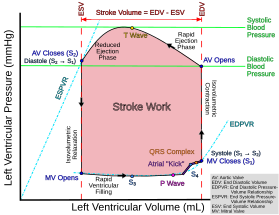
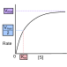
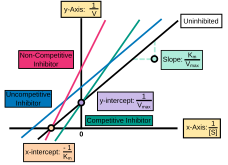
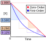
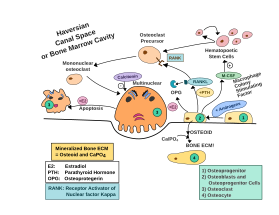

This page contains SVG diagrams I have made.

# Pressure Volume Loop

# Michaelis-Menten Enzyme Kinetics

# Lineweaver-Burk Plot

# Half-Life Graph

# Osteoclasts

# NICU Feed Math

<object class="pdf" 
            data=
"https://emleddin.github.io/meded/images/NICU-Feed-Math.pdf"
            width="800"
            height="500">
</object>